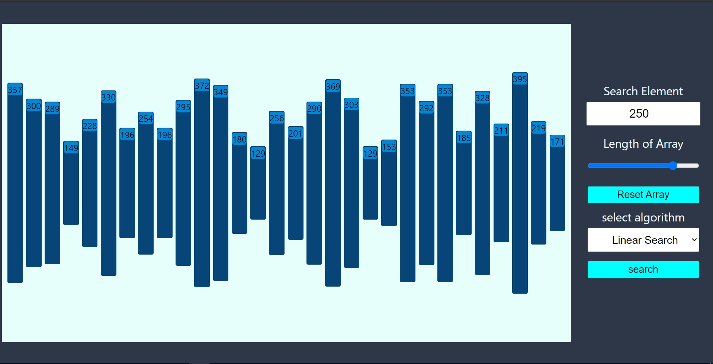
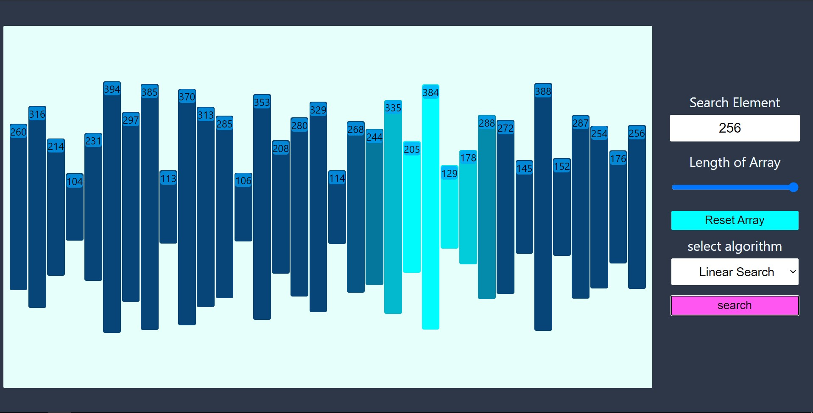

# Searching Algorithm Visualizer🔥

### Algorithms supported

- linear search
- binary search

 

 

 

## How to run locally
- clone the repo 
`git clone https://github.com/ashirbad29/searching-algorithm-visualizer.git`
 

- go to the root directory 
`cd searching-algorithm-visulizer`
 

- install required dependencies 
`npm install`
 

- start the project locally 
`npm start`
